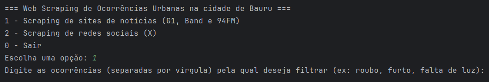

# Web Scraping de Ocorrências Urbanas

Este projeto faz parte de uma iniciação científica feita na Unesp Bauru, que visa fazer um levantamento de ocorrências urbanas que acontecem na cidade de Bauru-SP, utilizando como fonte de dados vários portais de noticias locais e redes sociais. Para isso, foram utilizadas técnicas de computação e ciência de dados com intuito de identificar informações e dados relevantes que indiquem tais ocorrências. Os dados foram extraídos utilizando a linguagem Python e as bibliotecas BeautifulSoup e Selenium, as ocorrências extraídas num arquivo CSV serão utilizadas para análise posterior. Após analisar os dados, o objetivo final será a disponiblização do conjunto de dados coletado e a criação de um Sistema de Informação Geográfica (SIG) que permita visualizar as ocorrências urbanas num mapa da cidade de Bauru, com o intuito de auxiliar tomadas de decisões baseadas em dados.

## Menu inicial



## Sites suportados

- [G1 Bauru](https://g1.globo.com/sp/bauru-marilia/)
- [Band Bauru](https://www.band.uol.com.br/band-multi/bauru-e-marilia/noticias)
- [94 FM](https://www.94fm.com.br/noticias/)

## Redes sociais suportadas

- [ X](https://x.com/) (em breve)

## Requisitos

- Python 3.x
- Google Chrome
- ChromeDriver

## Instalação

1. Clone o repositório:
    ```sh
    git clone https://github.com/f3l1pe-augusto/web-scraping-ocorrencias-urbanas.git
    cd web-scraping-ocorrencias-urbanas
    ```

2. Crie um ambiente virtual e ative-o:
    ```sh
    python -m venv venv
    source venv/bin/activate  # No Windows use `venv\Scripts\activate`
    ```

3. Instale as dependências:
    ```sh
    pip install -r requirements.txt
    ```

4. Baixe o [ChromeDriver](https://developer.chrome.com/docs/chromedriver/downloads?hl=pt-br) e adicione o caminho para o arquivo executável ao seu PATH.

## Uso

1. Execute o script `Main.py`:
    ```sh
    python Main.py
    ```

2. Insira as ocorrências pela qual deseja filtrar as notícias quando solicitado pelo script. 

3. As notícias filtradas serão salvas automaticamente num arquivo CSV na pasta `data`, permitindo análise posterior dos dados extraídos.

## Estrutura do Projeto

```plaintext
web-scraping-ocorrencias-urbanas/
├── Main.py                         # Script principal com menu de execução
├── requirements.txt                # Lista de dependências do projeto
├── README.md                       # Documentação do projeto
├── LICENSE                         # Licença de uso
├── scraper_core/                   # Módulo principal de scraping de notícias
│   ├── __init__.py
│   ├── run_news_scraper.py         # Executa o processo de scraping de notícias
│   ├── data/
│   │   └── df_all_news.csv         # Dados coletados em formato CSV
│   ├── log/
│   │   ├── __init__.py
│   │   └── LoggerConfig.py         # Configuração de logs para monitoramento e debug
│   ├── usecase/
│   │   ├── __init__.py
│   │   └── GetNewsUseCase.py      # Caso de uso principal para scraping das fontes de notícias
│   └── util/
│       ├── __init__.py
│       └── Util.py                # Funções utilitárias para o projeto (limpeza, formatação, extração de coordenadas, etc)
└── social_scraper/                # Estrutura inicial para scraping de redes sociais
└── __init__.py                    
    └── run_social_scraper.py      # Executa o processo de scraping de redes sociais
├── images/                        # Pasta com as imagens do projeto
│   ├── img.png                    # Imagem do menu inicial
```

## Contribuição

1. Faça um fork do projeto.
2. Crie uma branch: `git checkout -b minha-nova-feature`
3. Faça as suas alterações e commit: `git commit -am 'Adiciona nova feature'`
4. Envie para o repositório remoto: `git push origin minha-nova-feature`
5. Abra um Pull Request.

## Observações

### Google Geocoding API

Esse projeto utiliza a Google Geocoding API para converter endereços em coordenadas geográficas. Para utilizar essa funcionalidade, você precisará de uma chave de API do Google. Siga as instruções [aqui](https://developers.google.com/maps/documentation/geocoding/get-api-key) para obter a sua chave.

### Mudanças na Estrutura HTML

As páginas web podem alterar a sua estrutura HTML ao longo do tempo, o que pode ocasionar erros no scraper. Caso isso ocorra, será necessário atualizar o código para refletir as novas mudanças na estrutura das páginas. Fique atento a possíveis falhas na extração de dados e revise o código conforme necessário.

### Aviso Legal

Este projeto foi desenvolvido apenas para fins educacionais e não deve ser utilizado para coletar dados de sites sem a permissão dos seus proprietários. O uso indevido deste projeto é de responsabilidade do usuário.

## Licença

Este projeto está licenciado sob a Licença MIT. Veja o arquivo `LICENSE` para mais detalhes.
